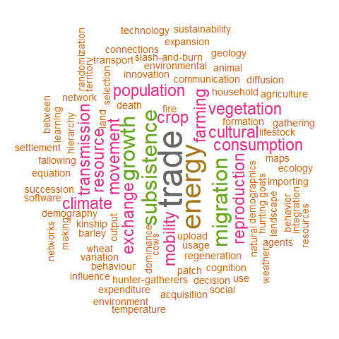
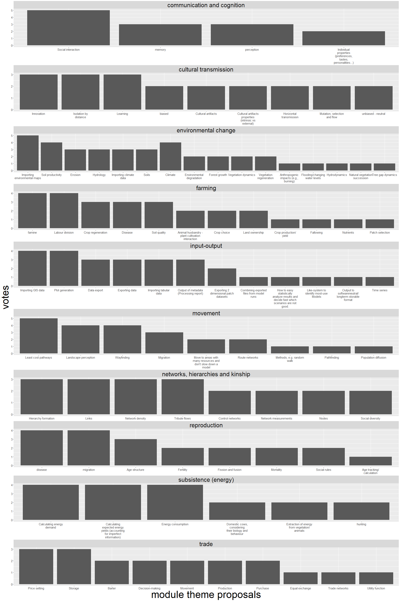
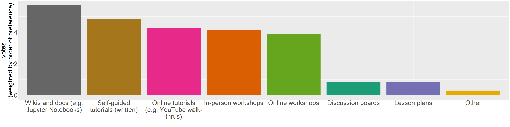
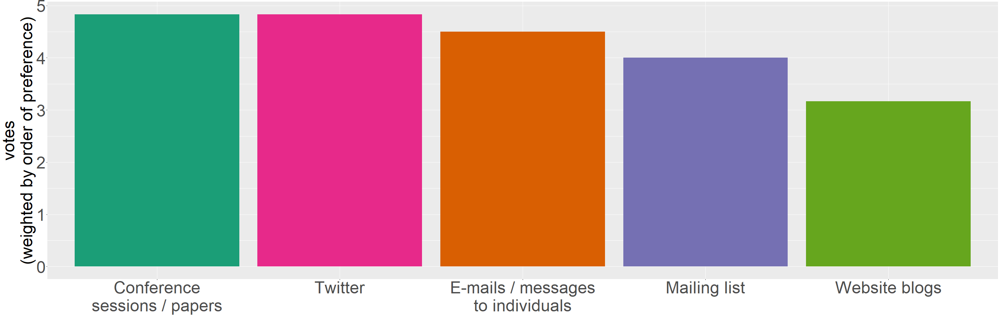

The following plots summarise the results of a four question consultation happening during the round-table session “Towards an open platform for computer simulations of past socioecological systems” at the CAA 2022 annual meeting in Oxford. Data was gathered and saved using two interactive online tools, [wooclap](https://app.wooclap.com/) and [Mentimeter](https://www.mentimeter.com/). 

Raw data can be found in `data-raw` and the processed version, which is effectivly used here, was stored in `data-processed`. Plots are saved in `plots`.

```{r setup, include=FALSE}
knitr::opts_chunk$set(echo = TRUE)

library(wordcloud)
library(RColorBrewer)
library(wordcloud2)
library(tm)

library(ggplot2)
library(stringr)  
```

## Question: keywords

> We're creating a library of modules, intended as bricks from which you can construct your model. But how to find the module that's right for you? If you were looking for a module to add to your ABM what kind of categories would you find useful? Write all that you can think of.

```{r}
data_keywords <- read.csv("data-processed/keywords.csv")
```

```{r}
data_keywords$Answer <- gsub(",", "", data_keywords$Answer)
```

```{r}
keywordRanking <- sort(rowSums(as.matrix(TermDocumentMatrix(data_keywords$Answer))), decreasing = TRUE)
keywordRanking <- data.frame(keyword = names(keywordRanking),freq = keywordRanking)
```

```{r}
png("plots/keywords.png", width = 480, height = 480)

set.seed(1234) # for reproducibility 

wordcloud(words = keywordRanking$keyword,
          freq = keywordRanking$freq,
          min.freq = 1,
          max.words=200,
          random.order=FALSE,
          rot.per=0.35,
          colors=brewer.pal(8, "Dark2"))
dev.off()
```

```{r}

```

NOTE: workflow tips taken from: https://towardsdatascience.com/create-a-word-cloud-with-r-bde3e7422e8a

## Question: modules

> What kind of modules should each of these categories include? Use the dropdown menu to see the categories. If the model is already listed, press on the heart to vote for it. You can add as many suggestions as you want.

```{r}
data_modules <- read.csv("data-processed/modules.csv")
```

```{r}
data_modules$voteCount <- data_modules$upvoteCount + 1
```

```{r}
plotScale = 10

png(paste0("plots/modules.png"), width = 200 * plotScale, height = 300 * plotScale)
ggplot(data = data_modules,
       aes(x = reorder(word, voteCount, decreasing = TRUE), y = voteCount)) + 
  geom_col() +
  facet_wrap(~category, ncol = 1, scales = "free") +
  scale_x_discrete(labels = function(x) str_wrap(x, width = 20)) +
  xlab("module theme proposals") +
  ylab("votes") +
  theme(
    axis.title = element_text(size = 5 * plotScale),
    axis.text = element_text(size = 1.5 * plotScale),
    strip.text = element_text(size = 3 * plotScale)
  )
  
dev.off()
```

```{r}

```

## Question: instruction materials

> What instruction materials would you use?

```{r}
data_instructions <- read.csv("data-processed/instructions.csv")
```

```{r}
data_instructions$weightedVote <- (max(data_instructions$question) - data_instructions$question + 1) / (max(data_instructions$question) + 1)
```

```{r}
instructionsOptions <- levels(factor(data_instructions$option))
instructionsOptions <- instructionsOptions[instructionsOptions != ""]

summedWeigthedVotes <- c()

for (aOption in instructionsOptions)
{
  summedWeigthedVotes <- c(summedWeigthedVotes, sum(data_instructions$weightedVote[data_instructions$option == aOption]))
}

data_instructions_weigthedVotes <- data.frame(cbind(instructionsOptions, summedWeigthedVotes))
data_instructions_weigthedVotes$summedWeigthedVotes <- as.numeric(data_instructions_weigthedVotes$summedWeigthedVotes)
```

```{r}
plotScale = 10
barColors <- factor(1:nrow(data_instructions_weigthedVotes))

png(paste0("plots/instructions.png"), width = 400 * plotScale, height = 100 * plotScale)
ggplot(data = data_instructions_weigthedVotes,
       aes(x = reorder(instructionsOptions, summedWeigthedVotes, decreasing = TRUE), 
           y = summedWeigthedVotes,
           fill = barColors)
       ) + 
  geom_col() +
  scale_x_discrete(labels = function(x) str_wrap(x, width = 20)) +
  xlab("") +
  ylab("votes\n(weighted by order of preference)") +
  scale_fill_brewer(palette = "Dark2", guide = F) +
  theme(
    axis.title = element_text(size = 5 * plotScale),
    axis.text = element_text(size = 5 * plotScale)
  )
  
dev.off()
```

```{r}

```

## Question: diffusion channels

> How would you inform others about the library?

```{r}
data_diffusion <- read.csv("data-processed/diffusion.csv")
```

```{r}
data_diffusion$weightedVote <- (max(data_diffusion$question) - data_diffusion$question + 1) / (max(data_diffusion$question) + 1)
```

```{r}
diffusionOptions <- levels(factor(data_diffusion$option))
diffusionOptions <- diffusionOptions[diffusionOptions != ""]

summedWeigthedVotes <- c()

for (aOption in diffusionOptions)
{
  summedWeigthedVotes <- c(summedWeigthedVotes, sum(data_diffusion$weightedVote[data_diffusion$option == aOption]))
}

data_diffusion_weigthedVotes <- data.frame(cbind(diffusionOptions, summedWeigthedVotes))
data_diffusion_weigthedVotes$summedWeigthedVotes <- as.numeric(data_diffusion_weigthedVotes$summedWeigthedVotes)
```

```{r}
plotScale = 10
barColors <- factor(1:nrow(data_diffusion_weigthedVotes))

png(paste0("plots/diffusion.png"), width = 300 * plotScale, height = 100 * plotScale)
ggplot(data = data_diffusion_weigthedVotes,
       aes(x = reorder(diffusionOptions, summedWeigthedVotes, decreasing = TRUE), 
           y = summedWeigthedVotes,
           fill = barColors)
       ) + 
  geom_col() +
  scale_x_discrete(labels = function(x) str_wrap(x, width = 20)) +
  xlab("") +
  ylab("votes\n(weighted by order of preference)") +
  scale_fill_brewer(palette = "Dark2", guide = F) +
  theme(
    axis.title = element_text(size = 5 * plotScale),
    axis.text = element_text(size = 5 * plotScale)
  )
  
dev.off()
```

```{r}

```

